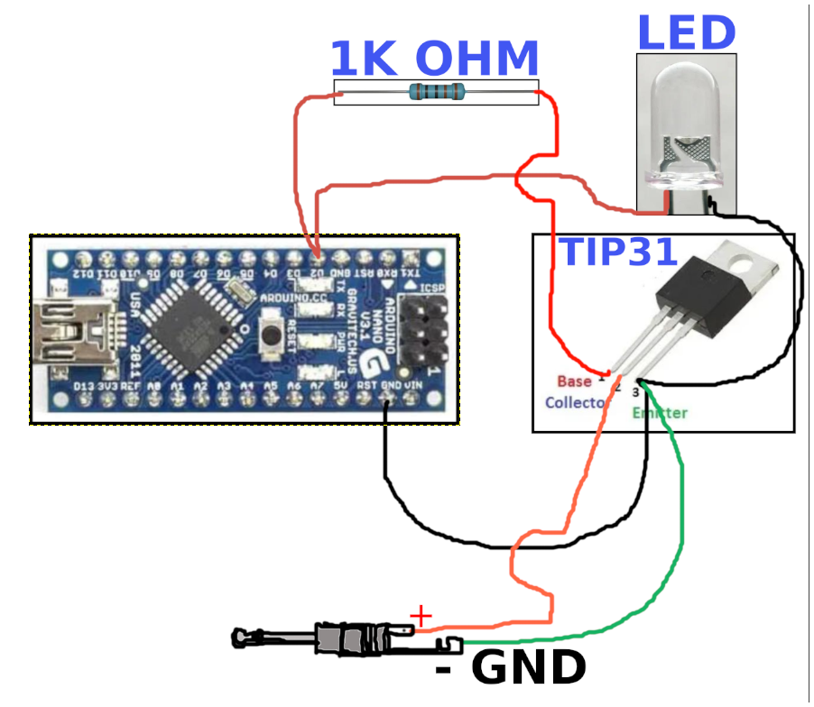

Designed with Arduino NANO as test platform.

This software will key Morse code (CW) by toggling a digital pin (D2) to ground. 

Observe how your transceiver accepts key input. It will not generate tones.

Use this code at your own risk.

This code involves controlling a digital output pin to simulate Morse code by turning it on and off according to the desired message. This pin can be connected to an LED for visual indication or to the base of an NPN transistor (with an appropriate resistor) to key a transmitter. 

<B>Hardware Setup:</B>

Visual Indicator: Connect an LED with a suitable current-limiting resistor between keyPin (D2) and ground. This will flash the LED in Morse code.

Transmitter Keying: To key a transmitter, connect keyPin to the base of an NPN transistor through a resistor (e.g., 1kΩ). Connect the collector to the transmitter's keying line and the emitter to ground. This setup allows the Arduino to safely control the transmitter's keying circuit.

<B>Notes:</B>

The dotDuration is calculated based on the desired words per minute (WPM). Adjust the wpm variable to change the speed.

The code is set with 15 wpm. Also note the beacon message has my callsign and my grid location. You should change that information before going on the air.

The getMorseCode function provides Morse code representations for alphanumeric characters. You can expand this function to include additional symbols as needed.

Ensure that the keyPin is capable of sourcing enough current for your specific application. When controlling external devices, always consider using appropriate interfacing components like transistors or opto-isolators to protect the Arduino.

<B>Versions:</B>

There are currently, a few versions of the code.

 - <b>cwbeacon.ino</b> = a simple CW beacon message without a tail tone. (TESTED OK)

 - <b>cwbeacontone.ino</b>  = a simple CW beacon message with a tail tone (TESTED OK)

 - <b>cwbeacon_viaptt.ino</b>  = uses the radio PTT key and audio input instead of the CW keyer (TESTED OK)

 - <b>rttybeacon.ino</b> = a simple RTTY beacon message. (TESTED OK)

 - <b>cwbeacongps.ino</b> = schedule CW beacon with time taken from GPS. requires GPS receiver. (TESTED OK)

 - <b>cwbeacongpsoled.ino</b> = scheduled CW beacon with time taken from GPS and an OLED screen to view UTC time and weekday.

----------------------------------

Notes:

TIP31 to commute TX CW

Arduino Nano (D2) → 1kΩ resistor → Base (PIN 1, TIP31) 

Arduino Nano (GND) → Emitter (PIN 3) of TIP31 

TX key line ← Collector (PIN 2) of TIP31 

My poor drawing for the TIP31 and LED wiring:

Below a link to a quick video for the TIP31 and LED wiring. This video is in Portuguese but with English legends:

(https://www.youtube.com/watch?v=b3ZLypYyTRo)

-----------------------------------

RTTY BEACON rttybeacon.ino

This is experimental

D2: Outputs 2125/2295 Hz FSK RTTY signal.

D3 (PTT): Goes HIGH 1 second before transmission and stays HIGH 1 second after.

D4 LED: Lights up during the entire PTT active period.

D5 LED: Flashes on each transmitted bit.

noTone() is called to stop the tone after transmission ends (fixes continuous tone issue).

RTTY format: 5N1.5 Baudot, ~45.45 baud, UPPERCASE only.

